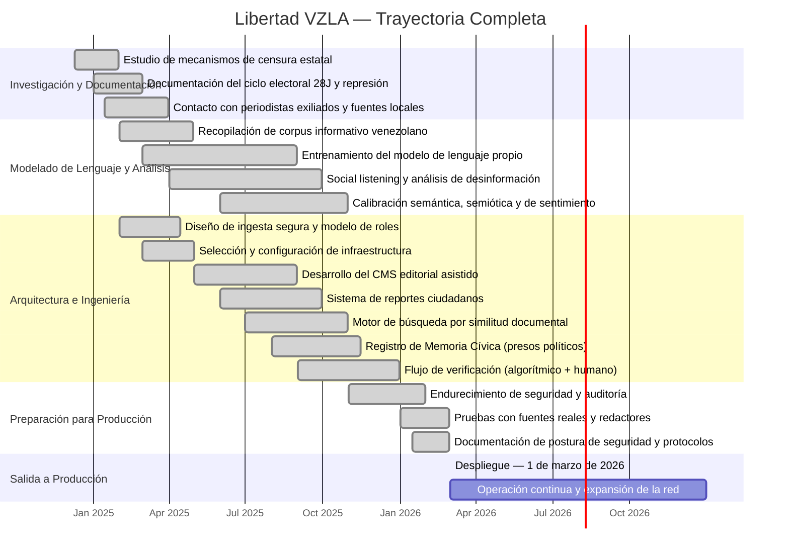
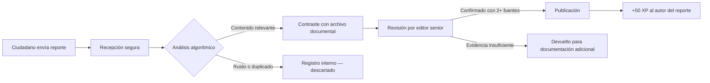

  

  
  
  

---

## 1. Qué es Libertad VZLA

**Libertad VZLA** es una plataforma de periodismo ciudadano, verificación documental y orquestación de datos cívicos. Fue diseñada para funcionar en entornos donde el acceso a la información independiente está activamente restringido por el Estado.

El sistema recibe reportes directos de ciudadanos, los contrasta con fuentes documentales y registros históricos, aplica capas de verificación —tanto algorítmica como humana— y publica información contrastada de interés público.

No es un medio de opinión. No es un blog. Es infraestructura informativa, construida para resistir.

**Acceso público:** [libertadvzla.vercel.app](https://libertadvzla.vercel.app)

---

## 2. Por qué fue necesario construir esto

### 2.1. El desmantelamiento progresivo de la prensa (2013–2024)

Desde 2013, bajo la administración de Nicolás Maduro, Venezuela experimentó un desmantelamiento progresivo de los medios independientes. No fue un proceso accidental; respondió a decisiones deliberadas y documentadas:

- **Cierre masivo de medios:** Más de 400 emisoras de radio clausuradas. La práctica totalidad de los medios impresos críticos desaparecieron, fueron adquiridos por grupos cercanos al gobierno o fueron asfixiados económicamente. (Fuente: Sociedad Interamericana de Prensa — SIP)
- **Redes de desinformación coordinada:** Desde 2010, el gobierno promovió la creación de estructuras denominadas *guerrillas comunicacionales* — colectivos organizados para saturar plataformas digitales con narrativas oficiales, hostigar a periodistas y manipular tendencias. (Fuente: LatAm Journalism Review)
- **Legislación como herramienta de censura:** La Ley Contra el Odio (2017) y la Ley de Fiscalización de ONG (2024) fueron utilizadas para criminalizar la crítica, restringir la financiación de organizaciones de verificación y forzar el exilio de profesionales de la comunicación.

Para 2024, Venezuela ocupaba el puesto 160 en el Índice Mundial de Libertad de Prensa (RSF). La SIP la clasificó, junto a Nicaragua, como país **"sin libertad de expresión"**.

### 2.2. El 28 de julio de 2024 y lo que vino después

Las elecciones presidenciales del 28 de julio de 2024 marcaron un antes y un después.

El Consejo Nacional Electoral (CNE) proclamó la reelección de Nicolás Maduro con el 51,20% de los votos, habiendo escrutado el 80% de las actas. La oposición, representada por María Corina Machado y Edmundo González Urrutia, rechazó los resultados. Según sus propios registros —basados en el 40% de las actas que lograron resguardar— González habría obtenido aproximadamente el 70% de los sufragios.

Lo que siguió fue una escalada represiva documentada por múltiples organizaciones:

- **2.000+ detenciones** en protestas post-electorales.
- **28 fallecidos** según informes de organizaciones de derechos humanos.
- **1.229 detenciones políticas** documentadas por Foro Penal entre el 29 de julio y el 8 de agosto.
- **14 periodistas detenidos arbitrariamente** en 2024, 11 de ellos después del 28J. (Fuente: IPYS Venezuela)
- **566 violaciones a la libertad de prensa** registradas hasta diciembre de 2024 — un incremento del 64% respecto a 2023.

### 2.3. El cerco digital

Simultáneamente, se desplegó la ofensiva de censura digital más agresiva en la historia del país:

- **79 sitios web bloqueados** entre julio de 2024 y enero de 2025. Portales como TalCual, Runrunes, El Estímulo y Medianálisis dejaron de ser accesibles para millones de venezolanos. (Fuente: VE Sin Filtro)
- **Bloqueo de herramientas de evasión:** CANTV, el proveedor de internet estatal, bloqueó intermitentemente los servidores DNS públicos de los principales proveedores globales — las herramientas más básicas que los ciudadanos usaban para sortear los filtros.
- **Restricción de redes sociales:** X (anteriormente Twitter) y TikTok sufrieron bloqueos parciales o totales.
- **23 medios adicionales cerrados** en 2024, incluyendo 21 emisoras de radio. (Fuente: Espacio Público)

### 2.4. La decisión

El **10 de diciembre de 2024** — Día Internacional de los Derechos Humanos —, un grupo reducido de ciudadanos venezolanos tomó una decisión que llevaba meses gestándose en conversaciones privadas: comenzar a construir.

No fue un manifiesto. No fue una declaración pública. Fue una conclusión lógica frente a un escenario concreto: la infraestructura de prensa independiente en Venezuela estaba siendo eliminada sistemáticamente, las vías digitales de evasión estaban siendo cerradas una por una, y no existía una plataforma con la resiliencia técnica necesaria para sobrevivir activamente a ese nivel de hostilidad.

El grupo — ingenieros de software, periodistas de investigación exiliados, analistas de fuentes abiertas y ciudadanos con experiencia en documentación cívica — se hizo una pregunta concreta: **¿Es posible construir un sistema de información ciudadana que resista bloqueos, censura algorítmica y persecución legal, sin sacrificar la rigurosidad periodística?**

Los meses siguientes se dedicaron a responder esa pregunta:

1. **Documentar los mecanismos técnicos de censura** empleados por el Estado, sus patrones de ejecución y sus puntos ciegos.
2. **Establecer canales seguros con periodistas exiliados y fuentes dentro del país**, construyendo una red de verificación humana con personas que ya operaban bajo condiciones de riesgo personal.
3. **Diseñar un sistema de ingesta de información ciudadana** que protegiera la identidad de los reporteros y no dependiera de infraestructura localizada en Venezuela.
4. **Desarrollar un modelo de lenguaje propio**, entrenado con corpus específicos del ecosistema informativo venezolano — un sistema de procesamiento con capacidad de comprensión semántica y semiótica, análisis de sentimiento, memoria contextual de largo plazo y detección de patrones de desinformación. Este modelo, con miles de millones de parámetros, fue afinado durante todo 2025 con datos reales del contexto informativo venezolano y latinoamericano.
5. **Implementar mecanismos de escucha social** (social listening) para monitorear en tiempo real la actividad de las redes de desinformación coordinada y detectar campañas de manipulación antes de que escalen.

---

## 3. Trayectoria del Proyecto

---

## 4. Cómo funciona la plataforma

### 4.1. El ciudadano en la cadena informativa

La plataforma no funciona como un medio tradicional con una redacción cerrada. Implementa un modelo distribuido donde los ciudadanos participan directamente en la cadena de información, asumiendo roles progresivos según su nivel de compromiso y su historial dentro del sistema:

| Rol | Qué hace | Cómo accede |
|:---|:---|:---|
| **Testigo** | Envía reportes sobre hechos que observó o documentó directamente. | Registro verificado en la plataforma. |
| **Reportero ciudadano** | Complementa reportes con fotografías, documentos o testimonios cruzados. | Historial de reportes previamente verificados. |
| **Verificador** | Participa en el contraste de información con fuentes independientes. | Por invitación del equipo editorial. |
| **Periodista** | Redacta, contextualiza y publica artículos con base en reportes verificados. | Credenciales profesionales validadas. |

Cada reporte que supera el proceso de verificación genera **+50 puntos de experiencia** para su autor. Esos puntos construyen un **índice de confianza** interno, medible y auditable. El sistema prioriza información de fuentes con historial comprobado, sin necesidad de conocer la identidad civil del ciudadano.

### 4.2. El proceso de verificación

El proceso tiene dos capas complementarias:

1. **Capa algorítmica:** Nuestro modelo de procesamiento convierte cada reporte en una representación vectorial y la compara contra el archivo histórico completo de la plataforma. Esto permite identificar precedentes, detectar patrones recurrentes y filtrar duplicados antes de que intervenga un ser humano.
2. **Capa editorial:** Un editor senior verifica cada publicación contra un mínimo de dos fuentes independientes. Ningún contenido se publica sin confirmación humana.

### 4.3. El sistema de procesamiento inteligente

La automatización en Libertad VZLA no genera contenido noticioso. Está diseñada para asistir al periodista, no para sustituirlo. El sistema opera con un modelo de lenguaje propietario, entrenado específicamente con el corpus informativo venezolano y calibrado para comprender no solo la semántica del texto, sino también su dimensión semiótica — es decir, los significados implícitos, las intenciones comunicativas y los patrones de manipulación discursiva.

Sus funciones son tres:

- **Asistencia contextual:** A partir de un titular o fragmento crudo de información ciudadana, el sistema genera un borrador con contexto histórico verificable. El periodista lo revisa, edita y aprueba manualmente antes de cualquier publicación.
- **Búsqueda por similitud documental:** Cada artículo y reporte se transforma en una representación numérica multidimensional. Cuando ingresa nueva información, el motor identifica automáticamente documentos relacionados por proximidad semántica — no por coincidencia de palabras, sino por cercanía de significado.
- **Clasificación y extracción de entidades:** El modelo identifica personas, lugares, cifras e instituciones mencionadas en cada reporte, y asigna categorías temáticas de forma automática.

El modelo fue entrenado durante todo 2025, fue refinado con datos reales del ecosistema de prensa venezolano y cuenta con capacidades de memoria contextual de largo plazo, análisis de sentimiento y detección de patrones de desinformación coordinada — funciones directamente derivadas del trabajo de escucha social realizado en la fase de investigación.

### 4.4. Registro de Memoria Cívica (Presos Políticos)

Este módulo no es un listado. Es un archivo estructurado, actualizable y auditable de personas detenidas por motivos políticos en Venezuela.

Decidimos construirlo porque después del 28 de julio de 2024, la cantidad de detenciones superó la capacidad de seguimiento de la mayoría de las organizaciones. Las familias no tenían acceso centralizado a información sobre el estado procesal de sus familiares, y las actualizaciones se dispersaban entre comunicaciones informales, notas de prensa esporádicas y declaraciones de ONG con recursos limitados.

El Registro de Memoria Cívica implementa:

- **Fichas individuales verificadas** con información procesal, ubicación de reclusión (cuando se conoce), estatus legal y cronología de eventos.
- **Acceso diferenciado por rol:** Los administradores y periodistas acreditados pueden actualizar registros. Los verificadores pueden cruzar datos. Los ciudadanos pueden consultar información pública.
- **Canal de participación familiar:** Los familiares directos de personas detenidas tienen la posibilidad de solicitar acceso especial a la plataforma. A través de este canal pueden: actualizar información que solo ellos conocen (cambios de ubicación, estado de salud, visitas denegadas), publicar testimonios directos y recibir orientación sobre recursos legales disponibles y organizaciones de asistencia.
- **Trazabilidad completa:** Cada modificación al registro queda auditada — quién cambió qué, cuándo y desde qué contexto. Esto protege la integridad del archivo contra manipulación.

El objetivo no es solo documentar. Es preservar memoria cívica verificable para que estos casos no se pierdan en el volumen de la crisis.

---

## 5. Infraestructura Técnica

La selección de cada componente del sistema respondió a un criterio: **resiliencia operativa en un entorno hostil**. No detallamos tecnologías específicas por razones de seguridad operacional: publicar el stack exacto equivale a entregar un mapa de superficie de ataque.

Lo que sí podemos describir son las funciones que cubre la arquitectura:

| Función | Descripción |
|:---|:---|
| **Renderizado en servidor** | Todo el contenido se procesa en el servidor antes de llegar al navegador. Esto elimina la dependencia de JavaScript del lado del cliente, que es el primer vector que se bloquea en entornos de censura. |
| **Aislamiento de datos por rol** | Cada usuario solo puede acceder a la información correspondiente a su nivel. Las políticas de seguridad se aplican a nivel de base de datos, no de aplicación — lo que significa que incluso si la capa de aplicación fuera comprometida, los datos permanecen segmentados. |
| **Búsqueda por similitud documental** | Los artículos y reportes se indexan como representaciones numéricas multidimensionales. Las consultas se resuelven por cercanía de significado, no por coincidencia textual. |
| **Modelo de lenguaje propietario** | Procesamiento de texto con comprensión semántica y semiótica, análisis de sentimiento y detección de patrones de desinformación. Entrenado con corpus específico del contexto informativo venezolano. |
| **Autenticación en servidor** | Las credenciales y sesiones se gestionan exclusivamente en el lado del servidor. No se exponen tokens en el navegador del usuario. |
| **Distribución global sin dependencia local** | La plataforma no depende de ningún servidor físico ubicado en Venezuela. El contenido se distribuye desde múltiples puntos geográficos con protección inherente contra ataques de denegación de servicio. |
| **Registro de auditoría** | Todas las acciones críticas (publicaciones, verificaciones, cambios de rol, modificaciones al registro de presos) quedan registradas con marcas temporales e identificación del actor. |

---

## 6. Postura de Seguridad

La plataforma opera bajo la premisa de que sus fuentes podrían enfrentar represalias físicas si su participación fuera expuesta. Las decisiones de ingeniería de seguridad están documentadas en detalle en [SECURITY.md](./SECURITY.md).

Principios operativos:

- Aislamiento de datos a nivel de base de datos, no de aplicación.
- Minimización de datos personales: no almacenamos información de identificación personal innecesaria de los testigos.
- Autenticación y gestión de sesiones exclusivamente en servidor.
- Registro de auditoría inmutable sobre acciones editoriales y administrativas.
- El modelo de amenazas contempla actores estatales con capacidad de interceptación de tráfico y presión legal.

---

## 7. Licencia y Participación

El código fuente de Libertad VZLA es propietario bajo licencia **Business Source License 1.1 (BSL 1.1)**. El acceso al repositorio de desarrollo es exclusivamente por invitación.

Buscamos activamente a personas con experiencia en:
- Ingeniería de sistemas distribuidos y seguridad aplicada.
- Periodismo de investigación con cobertura de Venezuela y América Latina.
- Análisis de fuentes abiertas (OSINT) y verificación documental.
- Procesamiento de lenguaje natural y construcción de modelos de lenguaje.
- Acompañamiento legal a víctimas de detención política.

---

## 8. Contacto

📧 **soyluissambrano@gmail.com**

---

  

