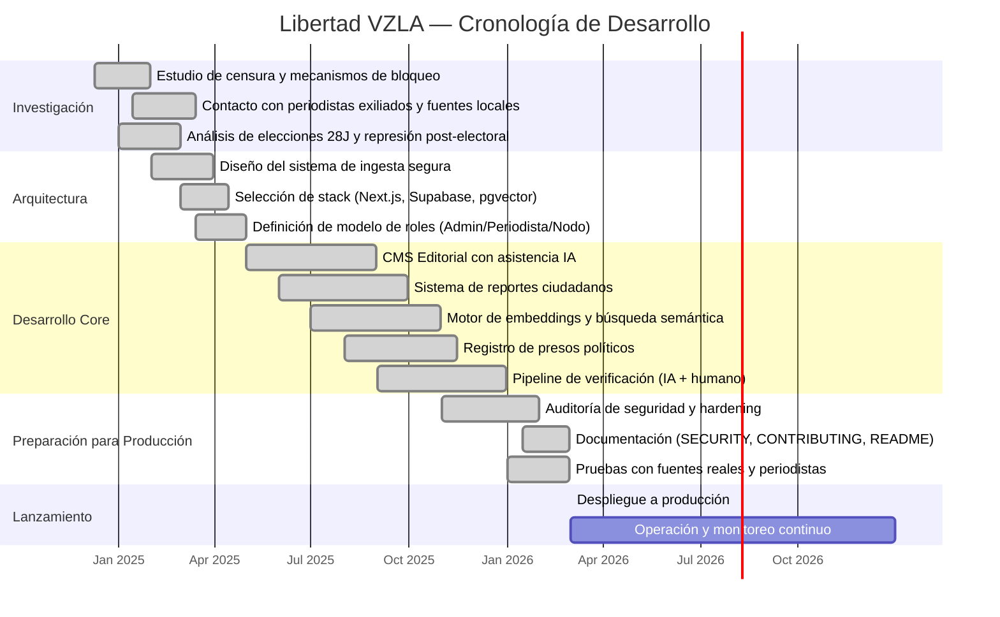
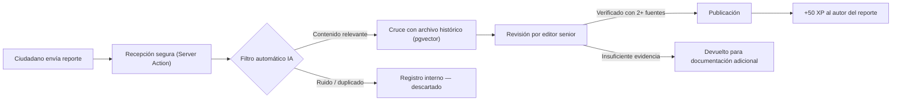

  

  
  
  

---

## 1. Descripción del Proyecto

**Libertad VZLA** es una plataforma de periodismo ciudadano y verificación de información diseñada para operar en entornos de alta censura. El sistema recibe reportes de ciudadanos, los cruza con fuentes documentales, aplica capas de verificación algorítmica y humana, y publica información contrastada de interés público.

La plataforma fue construida para abordar un problema estructural: la erosión progresiva del acceso a la información independiente en Venezuela. No se trata de un medio de opinión. Es una infraestructura técnica de recopilación, procesamiento y distribución de datos cívicos verificables.

**Acceso público:** [libertadvzla.vercel.app](https://libertadvzla.vercel.app)

---

## 2. Contexto: Por qué existe este proyecto

### 2.1. La degradación del ecosistema informativo (2013–2024)

Desde 2013, bajo la administración de Nicolás Maduro, Venezuela ha experimentado un deterioro sistemático de la libertad de prensa. Este deterioro no fue accidental, sino el resultado de políticas específicas:

- **Cierre de medios:** Más de 400 emisoras de radio cerradas. La casi totalidad de los medios impresos críticos desaparecieron o fueron adquiridos por grupos afines al gobierno. (Fuente: Sociedad Interamericana de Prensa — SIP)
- **Guerrillas comunicacionales:** Redes coordinadas de actores digitales creadas desde 2010 por el Estado para inundar plataformas con narrativas oficiales, atacar periodistas independientes y manipular tendencias algorítmicas. (Fuente: LatAm Journalism Review)
- **Legislación restrictiva:** La Ley Contra el Odio (2017) y la Ley de Fiscalización de ONG (2024) fueron instrumentalizadas para criminalizar la crítica y asfixiar financieramente a organizaciones de verificación de hechos.

Para 2024, Venezuela ocupaba el puesto 160 en el Índice de Libertad de Prensa de RSF y fue clasificada por la SIP junto a Nicaragua como país **"sin libertad de expresión"**.

### 2.2. Las elecciones presidenciales del 28 de julio de 2024

Las elecciones presidenciales de 2024 representaron un punto de inflexión. El Consejo Nacional Electoral (CNE) proclamó la reelección de Nicolás Maduro con el 51,20% de los votos (con el 80% de las actas escrutadas). La oposición, liderada por María Corina Machado y Edmundo González Urrutia, rechazó los resultados presentando registros propios basados en el 40% de las actas que poseían, los cuales indicaban una victoria de González con aproximadamente el 70% de los votos.

El período inmediatamente posterior fue crítico:

- **2.000+ detenciones** en protestas post-electorales.
- **28 fallecidos** según organizaciones de derechos humanos.
- **1.229 detenciones políticas** documentadas por Foro Penal entre el 29 de julio y el 8 de agosto.
- **14 periodistas detenidos arbitrariamente** solo en 2024, 11 de ellos después de las elecciones. (Fuente: IPYS Venezuela)
- **566 violaciones a la libertad de prensa** documentadas hasta diciembre de 2024. Un incremento del 64% respecto a 2023.

### 2.3. La ola de censura digital

En paralelo a la represión física, se ejecutó una ofensiva digital sin precedentes:

- **79 sitios web bloqueados** entre julio de 2024 y enero de 2025, incluyendo portales como TalCual, Runrunes, El Estímulo y Medianálisis. (Fuente: VE Sin Filtro)
- **Bloqueo de VPNs y DNS públicos:** CANTV, el proveedor estatal, bloqueó intermitentemente los servidores DNS de Google (8.8.8.8) y Cloudflare (1.1.1.1) — herramientas que los ciudadanos usaban para evadir la censura.
- **Restricción de plataformas:** X (anteriormente Twitter) y TikTok fueron bloqueadas parcial o totalmente.
- **Cierre de 23 medios de comunicación** adicionales en 2024, incluyendo 21 emisoras de radio. (Fuente: Espacio Público)

### 2.4. La decisión de construir

Fue en este contexto donde, el **10 de diciembre de 2024** — Día Internacional de los Derechos Humanos —, un grupo reducido de ciudadanos venezolanos inició un trabajo de investigación privado. No fue un acto grandilocuente. Fue una decisión pragmática frente a una realidad concreta: la infraestructura de información independiente en Venezuela estaba siendo desmantelada de forma sistemática, y no existía una alternativa técnicamente resiliente.

El grupo, compuesto por ingenieros de software, periodistas de investigación y analistas de datos, se planteó una pregunta operativa: **¿Es posible construir un sistema de información ciudadana que resista bloqueos DNS, censura algorítmica y persecución legal, y que al mismo tiempo mantenga estándares periodísticos verificables?**

Los siguientes meses se dedicaron a:

1. **Mapear la arquitectura de censura** — Documentar los mecanismos técnicos de bloqueo empleados (DNS poisoning, IP blocking, deep packet inspection).
2. **Establecer contacto con periodistas exiliados y fuentes locales** — Construir una red de verificación humana con personas que ya operaban bajo condiciones de riesgo.
3. **Diseñar un sistema de ingesta seguro** — Definir cómo un ciudadano común podría reportar un hecho sin exponer su identidad.
4. **Seleccionar un stack tecnológico resistente** — Priorizar edge deployment, renderizado en servidor y ausencia de dependencia de infraestructura localizada en Venezuela.
5. **Desarrollar protocolos de verificación asistidos por IA** — No como reemplazo del criterio humano, sino como una capa de procesamiento para cruce de fuentes y detección de patrones.

---

## 3. Cronología del Proyecto

---

## 4. Cómo Funciona

### 4.1. El modelo de participación ciudadana

La plataforma no depende exclusivamente de una redacción centralizada. Implementa un modelo distribuido donde los ciudadanos participan directamente en la cadena informativa con roles progresivos:

| Rol | Función | Requisitos |
|:---|:---|:---|
| **Testigo** | Envía reportes sobre hechos observados directamente. | Registro verificado en la plataforma. |
| **Reportero ciudadano** | Aporta documentación complementaria: fotografías, documentos, testimonios cruzados. | Historial de reportes verificados. |
| **Verificador** | Participa en el cruce de información con fuentes independientes. | Invitación del equipo editorial. |
| **Periodista** | Redacta, edita y publica artículos con base en reportes verificados. | Credenciales profesionales validadas. |

Cada reporte verificado genera **+50 XP** para el autor, lo que construye un **índice de confianza** (Trust Score) medible y transparente dentro del sistema. Este mecanismo permite priorizar fuentes con historial comprobado sin depender de la identidad real del ciudadano.

### 4.2. Pipeline de verificación

El pipeline combina dos capas:

1. **Capa algorítmica:** El motor de IA (Gemini) genera un embedding vectorial del reporte y lo compara contra el archivo histórico mediante similaridad de coseno (pgvector/HNSW). Esto permite detectar precedentes, patrones y duplicados antes de que un humano intervenga.
2. **Capa editorial:** Un editor senior verifica cada publicación contra un mínimo de dos fuentes independientes. No se publica sin confirmación humana.

### 4.3. Capacidades del motor de IA

La inteligencia artificial no genera noticias. Su función está limitada a tres tareas específicas de asistencia:

| Capacidad | Descripción | Tecnología |
|:---|:---|:---|
| **Expansión contextual** | A partir de un titular o fragmento crudo, asiste al periodista generando un borrador con contexto histórico verificable. El periodista edita y aprueba manualmente. | OpenRouter (Gemini Flash) |
| **Búsqueda semántica** | Cada artículo se convierte en un vector de 768 dimensiones. Al ingresar un nuevo reporte, el sistema identifica artículos relacionados por cercanía semántica, no por coincidencia textual. | Gemini Embedding 2 + pgvector |
| **Metadatos automáticos** | Extracción de entidades (personas, lugares, cifras), categorización temática y generación de meta descriptions para SEO. | OpenRouter (NLP) |

### 4.4. Registro de Presos Políticos

La plataforma incluye un archivo estructurado de presos políticos con niveles granulares de acceso. Este módulo permite a la redacción y a organizaciones de derechos humanos documentar, actualizar y consultar el estado de personas detenidas por motivos políticos en Venezuela.

---

## 5. Stack Técnico

| Componente | Tecnología | Justificación |
|:---|:---|:---|
| Framework | Next.js 14+ (App Router) | Renderizado en servidor (SSR) para resiliencia ante bloqueos de JavaScript del lado del cliente. |
| Base de datos | Supabase (PostgreSQL) | Row Level Security (RLS) para aislamiento de datos por rol. |
| Búsqueda vectorial | pgvector (HNSW) | Indexación semántica de artículos y reportes con latencia marginal. |
| IA | Gemini 2.0 + OpenRouter | Procesamiento de lenguaje natural: embeddings, expansión y clasificación. |
| Autenticación | Supabase Auth (SSR) | OAuth (Google) + sesiones seguras en servidor. |
| Frontend | TailwindCSS + Framer Motion | Sistema de diseño tokenizado con animaciones de física orgánica. |
| Despliegue | Vercel Edge Network | Distribución global, protección DDoS inherente, sin dependencia de servidores localizados en Venezuela. |
| Auditoría | Sistema de logs interno | Registro de acciones críticas (publicaciones, verificaciones, cambios de rol). |

---

## 6. Seguridad

La plataforma maneja datos que pueden poner en riesgo la integridad física de sus fuentes. Las decisiones de seguridad están documentadas en detalle en [SECURITY.md](./SECURITY.md). Resumen:

- RLS (Row Level Security) sobre todas las tablas. Cada rol solo accede a los datos que le corresponden.
- No se almacena PII (información de identificación personal) innecesaria de los testigos.
- Autenticación exclusivamente en servidor (SSR Auth) — no se exponen tokens en el cliente.
- Audit trail completo sobre acciones editoriales y administrativas.
- El modelo de amenazas contempla actores estatales con capacidad de interceptación de tráfico.

---

## 7. Licencia y Colaboración

El código fuente de Libertad VZLA es **propietario** bajo licencia **Business Source License 1.1 (BSL 1.1)**. El acceso al repositorio de desarrollo está restringido por invitación.

Buscamos colaboradores con experiencia en:
- Ingeniería de software (TypeScript, Next.js, PostgreSQL).
- Periodismo de investigación, especialmente con cobertura de Venezuela y América Latina.
- Análisis OSINT y verificación de fuentes abiertas.
- Criptografía aplicada y seguridad operacional.

---

## 8. Contacto

Para consultas sobre colaboración, acceso al repositorio o información sobre el proyecto:

📧 **soyluissambrano@gmail.com**

---

  

