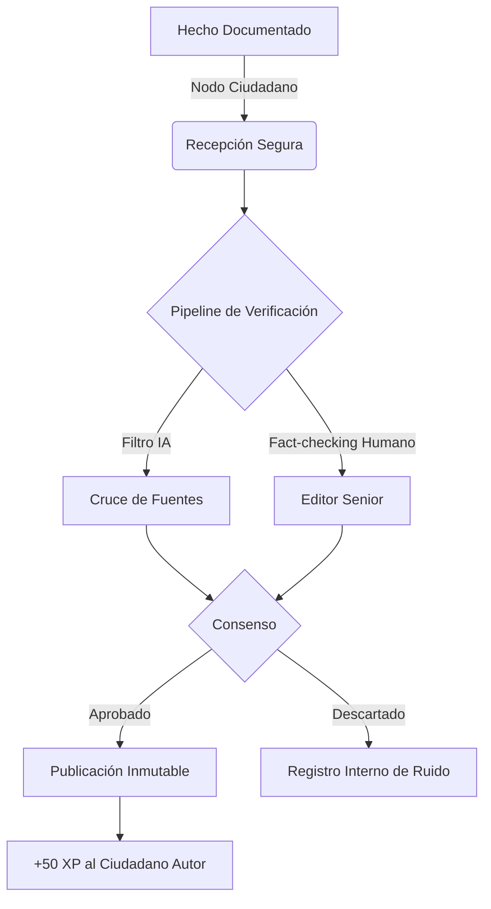
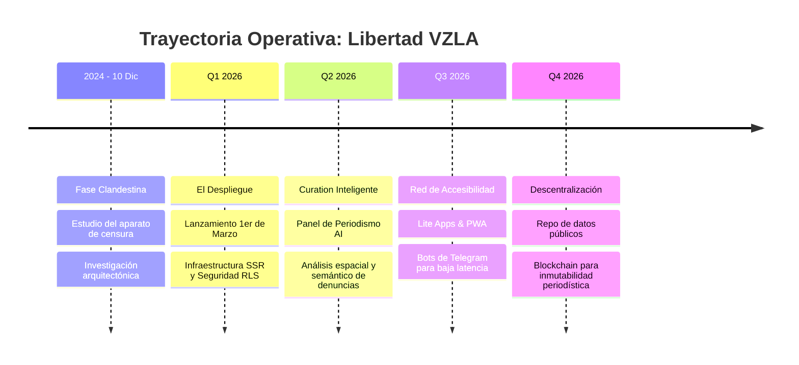

  

*Plataforma de periodismo ciudadano, verificación algorítmica y orquestación de datos cívicos.*  
*[🔗 Acceso a la Plataforma en Vivo](https://libertadvzla.vercel.app)*

---

## 📜 Contexto Histórico y Nacimiento de la Iniciativa

Desde 2013, la infraestructura comunicacional en Venezuela ha sufrido un progresivo y sistemático proceso de erosión. El aparato estatal implementó tácticas avanzadas de censura, bloqueos DNS a portales de noticias independientes y el despliegue masivo de las denominadas *guerrillas comunicacionales* —redes coordinadas para la propagación de desinformación (fake news) y manipulación algorítmica en plataformas digitales.

El **10 de diciembre de 2024**, frente al recrudecimiento de estos bloqueos y la opacidad informativa, un grupo reducido de ciudadanos, ingenieros y periodistas de investigación venezolanos iniciaron una fase de estudio clandestino. El objetivo: comprender la arquitectura de censura del Estado y diseñar infraestructuras digitales autosustentables, asíncronas y descentralizadas capaces de penetrar el cerco mediático. 

El resultado de esa investigación es **Libertad VZLA**, un sistema técnico y humano que ve la luz de cara a producción el **1 de marzo de 2026**. Un portal diseñado no solo para informar, sino para estructurar un flujo inmutable de la verdad donde el ciudadano común evoluciona en la cadena informativa.

---

## 🎯 Brújula Estratégica

Basado en nuestro [Manifiesto de Diseño y Desarrollo], nuestras bases fundacionales son claras:

### La Misión
Verificar, estructurar y democratizar el acceso a la información sobre Venezuela. Derribar la censura y la manipulación mediante herramientas tecnológicas de código abierto, estructuras seguras y periodismo de datos algorítmicamente fortalecido.

### La Visión
Convertirnos en el estándar de oro (*Single Source of Truth*) para la verificación de hechos en el ecosistema informativo venezolano. Fusionar la escalabilidad de la Inteligencia Artificial con el rigor ético e inquebrantable del periodismo tradicional.

### El Objetivo
Construir un archivo inmutable de noticias, reportes económicos e investigaciones profundas que empodere al ciudadano con contexto histórico y datos verificables en tiempo real, garantizando la preservación de la memoria cívica.

---

## 🏛 El Ciudadano como Eje: Red de Periodismo Distribuido

En Libertad VZLA, hemos redefinido el rol del usuario pasivo. A través de nuestra integración de nodos, los ciudadanos evolucionan a través de una escalera de compromiso cívico:

1. **Testigo (Nodo Origen):** Generador de reportes asíncronos encriptados frente a hechos de interés.
2. **Reportero Ciudadano:** Participante activo en la consolidación de pruebas, cruce de información y soporte documental.
3. **Guardián de la Verdad:** Colaborador en el modelo de verificación. Cada aporte cruzado y validado genera **XP (Puntos de Experiencia)** que certifican el grado de confianza del usuario (Trust Score) dentro del sistema.
4. **Divulgador:** Agente libre de la propagación de información ya verificada, utilizando redes mesh o canales de baja latencia.

---

## 🧠 Arquitectura Cognitiva (IA) y Flujo Editorial

El sistema no depende únicamente del factor humano; está **potenciado por modelos de lenguaje de alto desempeño (Gemini 2.0 y motores OpenRouter)** en su backend. La IA no actúa como creadora de noticias falsas, sino como una *máquina de contexto y auditoría lógica*.

### Funcionalidades Core Potenciadas con IA:

- **Expansión Semántica Contextual:** A partir de alertas sintéticas o *snippets* crudos de información ciudadana, el sistema asiste al periodista generando artículos profesionales, agregando únicamente contexto histórico comprobable sin alucinación de datos.
- **Motores Temporales y Vectoriales (`pgvector`):** Cada hecho documentado se convierte en un *embedding* de 768 dimensiones. Al ingresar un nuevo reporte, el motor de **Cosine Similarity** busca y asocia inmediatamente precedentes en el archivo histórico.
- **Metadatos y SEO Automático:** Extracción en tiempo real de entidades (Nombres, Lugares, Cifras) para etiquetado semántico y categorización precisa (Economía, Política, etc.).

---

## 🗺️ Roadmap de Implementación (2024 - 2026)

---

## 🛡️ Seguridad y Manejo de Datos

Para operar contra un aparato gubernamental asimétrico, la protección de las fuentes es crítica.

- **Defensa en Profundidad:** Autenticación estricta (SSR Auth) y políticas de RLS (*Row Level Security*) a nivel de base de datos.
- **Registro de Presos Políticos:** Un archivo encriptado y auditable con niveles granulares de acceso (Admin, Periodista, Nodo local).
- **Commitment de Privacidad:** No almacenamos información de identidad identificable (PII) innecesaria de nuestros testigos. 
- *Para detalles técnicos de la auditoría de seguridad, los colaboradores evaluados tienen acceso al repositorio privado base.*

---

## 💻 Stack Tecnológico (Core)

| Dominio | Tecnología | Justificación de Arquitectura |
| :--- | :--- | :--- |
| **Framework Base** | Next.js 14+ (App Router) | Renderizado híbrido ultrarrápido (SSR/SSG). |
| **Base de Datos** | Supabase (PostgreSQL) | Zero-trust RLS y respuestas asíncronas de bajo costo. |
| **Vector DB** | `pgvector` | Indexación por similaridad de coseno (HNSW). |
| **Motor Cognitivo**| Gemini Flash / OpenRouter | Procesamiento de NLP y extracción semántica. |
| **Estilización** | TailwindCSS + Framer Motion | Carga paralela de CSS, render tipográfico limpio (`Inter`), físicas orgánicas. |
| **Despliegue** | Vercel (Edge Network) | Resiliencia DDoS y latencia marginal global. |

---

## 🤝 Contacto y Colaboración (Private & Proprietary)

El acceso a la base de código principal está **restringido por invitación**. Buscamos activamente a ingenieros de software, analistas OSINT y criptógrafos comprometidos con la causa de la libertad de expresión.

**Propiedad y Licencia:** Codebase propietario bajo licencia **BSL 1.1** (Business Source License). 

📧 **Contacto principal para operaciones y colaboración técnica:**  
`soyluissambrano@gmail.com`

---
*«La oscuridad informativa se combate con datos irrebatibles y código inquebrantable.»*
